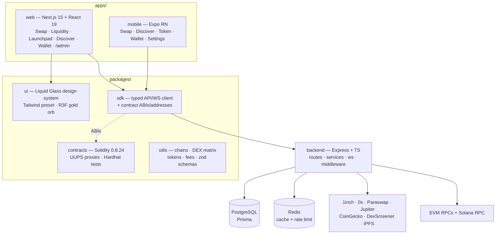

# XAUConnect

**The Most Liquid Gold-Standard DEX Aggregator & Meme Launch Platform.**

XAUConnect sits in front of 25+ DEX venues across 7 chains as a fee-capturing
aggregation layer: best-price swaps, aggregated LP zaps, one-click token
launches, pump.fun-style bonding curves, market discovery, a multi-chain
wallet view, and a full admin operations console — wrapped in a Liquid
Glassmorphism design system (white `#F8F9FA` · gold `#FFD700/#FFAA00` · pink
`#FF69B4 → #FFB6C1`).

---

## Architecture



### Aggregation & fee model

Every routed action passes through XAUConnect's fee logic:

| Function            | Fee                      | Where it's enforced                          |
| ------------------- | ------------------------ | -------------------------------------------- |
| Swap                | 0.25–0.75% (default 0.30%) | `AggregatorRouter.sol` skim + backend quoting |
| LP add/remove       | 0.10% of zapped amount   | `LiquidityZap.sol` + LP service              |
| Token launch        | flat fee (native/USDC/XAU) | `TokenFactory.sol`                           |
| Bonding curve trade | 1% per buy/sell          | `Launchpad.sol`                              |
| Curve graduation    | flat graduation fee      | `Launchpad.sol`                              |
| Discover listing    | flat USD fee (admin queue) | backend + admin dashboard                    |

All fees accrue to `FeeCollector` (per-chain, per-type bps config 25–75,
role-gated withdrawals).

**DEX matrix:** Uniswap V2/V3, SushiSwap (Ethereum) · PancakeSwap V2/V3,
BiSwap, ApeSwap (BSC) · QuickSwap, Uniswap V3 (Polygon) · Uniswap V3, Camelot
(Arbitrum) · Uniswap V3, Aerodrome, BaseSwap (Base) · Trader Joe, Pangolin
(Avalanche) · Raydium, Orca, Jupiter (Solana) · plus 1inch / 0x / Paraswap
meta-aggregation. New venues register as adapters — no core changes.

---

## Quick start

Prerequisites: **Node ≥ 20**, **pnpm 10** (`corepack enable`), Docker
(optional — for Postgres/Redis).

```bash
# 1. Install
pnpm install

# 2. Environment (demo mode works with zero keys)
cp .env.example .env
cp .env.example apps/web/.env.local   # only NEXT_PUBLIC_* are read here

# 3. (optional) Infrastructure
docker compose up -d db redis
pnpm db:generate
pnpm --filter @xauconnect/backend db:migrate
pnpm --filter @xauconnect/backend db:seed

# 4. Run everything (web :3000 + backend :4000)
pnpm dev
```

Without API keys/database the platform runs in **demo mode**: live quoting
still hits public DEX contracts and DexScreener; everything else falls back to
realistic deterministic data and the UI labels it `demo`.

### Smart contracts

```bash
pnpm contracts:test                                  # full Hardhat suite
pnpm --filter @xauconnect/contracts deploy -- --network sepolia
# then paste printed addresses into packages/sdk/src/contracts.ts
```

### Mobile

```bash
cd apps/mobile && npm install && npx expo start
```

(Outside the pnpm workspace on purpose — see `apps/mobile/README.md`.)

---

## Repository layout

```
xauconnect/
├── apps/
│   ├── web/                # Next.js 15 — all pages + /admin console
│   └── mobile/             # Expo RN app (own node_modules)
├── packages/
│   ├── ui/                 # Liquid Glass components + Tailwind preset + R3F
│   ├── sdk/                # Typed REST/WS client + contract ABIs
│   ├── utils/              # Chains, DEX matrix, tokens, fees, zod schemas
│   └── contracts/          # Solidity + Hardhat tests + deploy scripts
├── backend/                # Express API + WebSocket server
├── prisma/                 # Database schema (users, tokens, launches, swaps…)
├── docker-compose.yml      # Postgres + Redis + backend + web
└── turbo.json              # Task pipeline
```

---

## Environment variables

Every integration is optional and degrades to demo data. Full reference with
comments: [`.env.example`](./.env.example).

| Variable | Purpose | Required |
| --- | --- | --- |
| `DATABASE_URL` | PostgreSQL (Prisma) — persistence for users/swaps/launches | No (demo) |
| `REDIS_URL` | Cache + rate limiting | No (in-memory) |
| `JWT_SECRET` | Session token signing | **Yes (prod)** |
| `ADMIN_ADDRESSES` | Wallets granted ADMIN role on sign-in | For /admin |
| `PROTOCOL_FEE_BPS_*`, `LP_FEE_BPS`, `LAUNCHPAD_CURVE_FEE_BPS` | Default fee config | No |
| `FEE_RECIPIENT` | FeeCollector proxy address | After deploy |
| `RPC_ETHEREUM` … `RPC_SOLANA` | Chain RPC endpoints | No (public RPCs) |
| `ONEINCH_API_KEY`, `ZEROX_API_KEY`, `PARASWAP_API_KEY`, `JUPITER_API_KEY` | Meta-aggregator quotes | No |
| `COINGECKO_API_KEY`, `BIRDEYE_API_KEY` | Market data enrichment | No |
| `WEB3_STORAGE_TOKEN` | IPFS pinning for launch metadata | No (data URI) |
| `DEPLOYER_PRIVATE_KEY`, `ETHERSCAN_API_KEY`, `BSCSCAN_API_KEY` | Contract deploy/verify | For deploy |
| `NEXT_PUBLIC_API_URL`, `NEXT_PUBLIC_WS_URL` | Web → backend endpoints | Yes |
| `NEXT_PUBLIC_WALLETCONNECT_PROJECT_ID` | RainbowKit / WalletConnect v2 | **Yes (prod)** |

---

## Deployment

### Docker (single host)

```bash
docker compose up -d --build      # db + redis + backend + web
```

### Vercel (web) + any Node host (backend)

1. **Web** — import the repo in Vercel, set root directory `apps/web`,
   framework Next.js, and the `NEXT_PUBLIC_*` env vars. Turborepo is detected
   automatically.
2. **Backend** — deploy `backend/Dockerfile` to Fly.io / Railway / AWS ECS /
   GCP Cloud Run. Provision managed Postgres + Redis, set env vars, run
   `prisma migrate deploy` on release.
3. **Contracts** — deploy per chain with the Hardhat script, verify on the
   explorer, update `packages/sdk/src/contracts.ts` + `FEE_RECIPIENT`, and
   redeploy web/backend.

### CI

GitHub Actions workflow at
[`.github/workflows/ci.yml`](./.github/workflows/ci.yml): typecheck + build
all workspaces and run the full Hardhat contract suite on every PR.

---

## Status & honest scope

Everything in this repo compiles and runs locally: the web app and backend in
demo-or-live mode, contracts fully tested on the Hardhat network, mobile via
Expo. The following are **structured placeholders** per spec, with module
boundaries ready: limit orders, KYC flows, snipers detection, dev-wallet
tracking, embedded wallet (audit-gated), Curve/Balancer/GMX adapters, and
Solana-native execution (Jupiter quotes are live; signing ships with the
embedded Solana signer).

## Next steps checklist

- [ ] Set `JWT_SECRET`, `ADMIN_ADDRESSES`, `NEXT_PUBLIC_WALLETCONNECT_PROJECT_ID`
- [ ] Provision Postgres + Redis; run migrations + seed
- [ ] Add RPC keys (Alchemy/Infura) and aggregator API keys (1inch, 0x)
- [ ] Deploy contracts to testnets → verify → fill `packages/sdk/src/contracts.ts`
- [ ] Point `FEE_RECIPIENT` at the deployed FeeCollector proxy
- [ ] Configure `WEB3_STORAGE_TOKEN` for real IPFS pinning
- [ ] Commission an external smart-contract audit before mainnet
- [ ] Pen-test the API (auth, rate limits, input validation)
- [ ] Set up monitoring/alerts (uptime, RPC health, fee accrual)
- [ ] App Store / Play Store assets + WalletConnect mobile linking
- [ ] Legal review: terms, token listing policy, jurisdictional gating

## License

MIT
