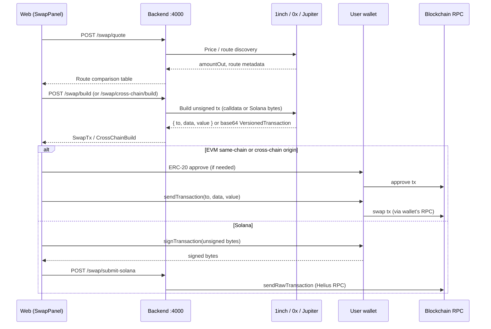

# Swap execution — where transactions actually go

XAUConnect is **non-custodial**. Aggregators (1inch, 0x, Jupiter) never hold user funds and **never broadcast** swaps on your behalf. They return prices and unsigned transaction payloads; execution always happens in the user’s wallet (EVM) or via server RPC broadcast of a **wallet-signed** Solana tx.

## End-to-end flow



## What each API does

| Step | Endpoint | Who runs it | On-chain? |
|------|----------|-------------|-----------|
| Quote | `POST /swap/quote` | Backend → aggregators | No |
| Cross-chain quote | `POST /swap/cross-chain/quote` | Backend → 0x / 1inch Fusion+ | No |
| Build | `POST /swap/build` | Backend → aggregator **build** APIs | No — returns calldata only |
| Cross-chain build | `POST /swap/cross-chain/build` | Backend → 0x / 1inch relayer | No — returns calldata only |
| EVM execute | *(browser)* `wagmi` `sendTransaction` | **User wallet** → wallet’s RPC | **Yes** |
| EVM approve | *(browser)* `writeContract` approve | **User wallet** | **Yes** |
| Solana execute | `POST /swap/submit-solana` | Backend broadcasts **signed** tx | **Yes** (via `RPC_SOLANA` / Helius) |

### Same-chain EVM (1inch / 0x meta routes)

1. **Quote** — `GET {ONEINCH_API_BASE}/swap/v6.0/{chainId}/quote` (or 0x `/swap/allowance-holder/price`).
2. **Build** — `GET .../swap` with `from={taker}` → `{ tx: { to, data, value } }`.
3. **Execute** — `apps/web/src/components/swap/swap-panel.tsx` calls `sendTransactionAsync({ to, data, value })`. Wagmi/RainbowKit sends the tx through the **connected wallet’s provider** (MetaMask, Rabby, etc.) to Ethereum/BSC/Base/… RPC.

Code path: `buildSwapTx` → `buildMetaEvmSwap` → `build1inchSwap` / `build0xSwap` in `backend/src/services/routing/meta.ts`.

### Cross-chain EVM origin

1. **Quote** — 0x `/cross-chain/quotes` or 1inch `{ONEINCH_API_BASE}/fusion-plus/quoter/v1.2/quote/receive`.
2. **Build** — 0x cross-chain build or 1inch `{ONEINCH_API_BASE}/fusion-plus/relayer/v1.2/orders/create/evm` → origin-chain calldata.
3. **Execute** — same as above: user wallet `sendTransaction` on the **source chain**. Bridge settlement is handled by the bridge protocol (Across, 1inch relayer, etc.) after the origin tx confirms.

Composite routes (swap → bridge → swap) may require multiple wallet txs; see `executeCompositeCrossChain` in `swap-panel.tsx`.

### Solana

1. **Quote / build** — Jupiter `/order` or `/build` → base64 **unsigned** `VersionedTransaction`.
2. **Sign** — Phantom/Solflare in the browser.
3. **Broadcast** — `POST /swap/submit-solana` → `backend/src/services/solana-submit.ts` → `Connection.sendRawTransaction` on **server RPC** (`RPC_SOLANA`, typically Helius). This avoids browser 403s on public RPC endpoints.

### Own router path (optional)

If `ROUTER_ADDRESS_{CHAIN}` is set, direct DEX routes build calldata for your deployed `AggregatorRouter` instead of 1inch/0x. Execution is still **wallet `sendTransaction`** to that router address.

---

## 1inch API base URL

| Variable | Default | Purpose |
|----------|---------|---------|
| `ONEINCH_API_KEY` | *(required for 1inch routes)* | Bearer token from [1inch Business](https://business.1inch.com/) |
| `ONEINCH_API_BASE` | `https://api.1inch.com` | Host for all 1inch HTTP calls |

Both hosts work with the same key today:

- `https://api.1inch.com` — current 1inch Business host (**default**)
- `https://api.1inch.dev` — legacy Developer Portal host (supported through **2026-01-31** per 1inch)

Implementation: `backend/src/services/routing/oneinch-api.ts` (`oneInchUrl()`). Used by:

- `meta.ts` — Swap API v6 quote + swap build
- `cross-chain.ts` — Fusion+ quote + relayer order create

To stay on the legacy host until migration:

```env
ONEINCH_API_BASE=https://api.1inch.dev
```

No code change required — restart `xauconnect-backend` after updating `C:\xauconnect\.env`.

---

## 0x and Jupiter (same pattern)

| Provider | Quote | Build | Execute |
|----------|-------|-------|---------|
| **0x** | `api.0x.org/.../price` | `api.0x.org/.../quote` | Wallet `sendTransaction` |
| **0x cross-chain** | `api.0x.org/cross-chain/quotes` | cross-chain build API | Wallet on origin chain |
| **Jupiter** | `api.jup.ag/.../order` | `.../build` | Wallet sign → `/swap/submit-solana` |

None of these providers broadcast EVM swaps for you in our integration.

---

## Related files

| File | Role |
|------|------|
| `backend/src/services/routing/engine.ts` | Fan-out quotes to venues |
| `backend/src/services/routing/build.ts` | Build + simulate swap tx |
| `backend/src/services/routing/meta.ts` | 1inch / 0x / Jupiter adapters |
| `backend/src/services/routing/cross-chain.ts` | Cross-chain quote + build |
| `backend/src/services/routing/oneinch-api.ts` | `ONEINCH_API_BASE` helper |
| `backend/src/services/solana-submit.ts` | Solana broadcast only |
| `apps/web/src/components/swap/swap-panel.tsx` | Wallet approval + send |
| `backend/src/routes/swap.ts` | HTTP routes |
